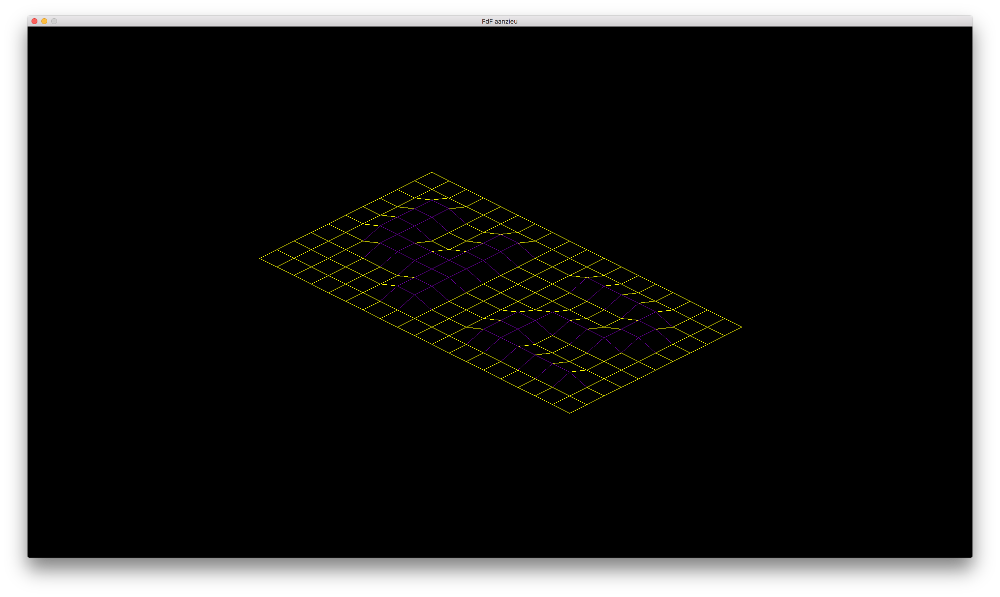
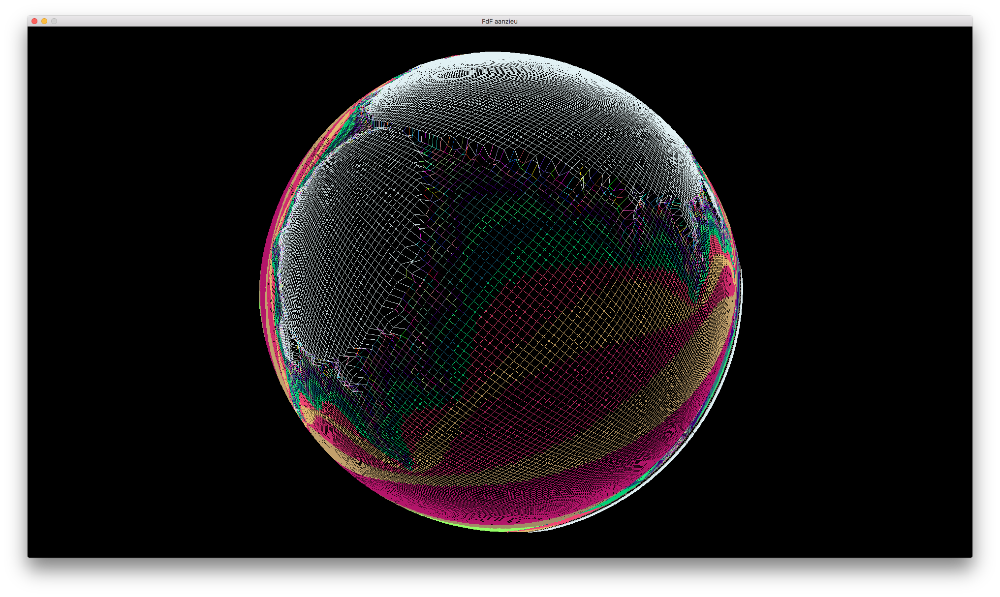

# FDF

## Description

A simple 3D height-map renderer. You can rotate models, color is defined by relative height in the map.

### Features

- 3D rotations
- Camera controls (zoom, translate)
- color gradients!
- Other projections (Use I, O, P)

## Dependencies

Minilibx

## Installation

Clone the repository and run with:

``` bash
$> make
$> ./fdf test_map/[file]
```

To run all map launch:
``` bash
$> sh programmerun.sh
```

## Media





## Authors

Antoine Anzieu
aanzieu@student.42.fr
